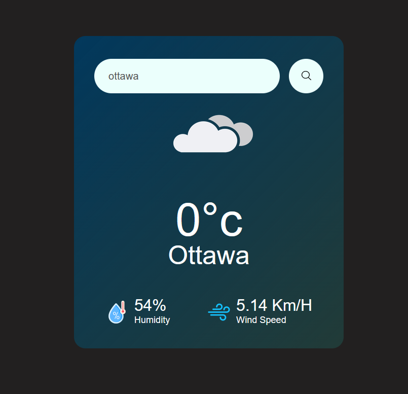

Weather App (OpenWeather)

A simple, clean weather app built with HTML + CSS + JavaScript that fetches real-time weather data from the OpenWeather API. Users can search by city name and see temperature, humidity, wind speed, and a matching weather icon.

index

Features

Search weather by city name

Shows:

Temperature (°C)

Humidity (%)

Wind speed (Km/h)

Displays an error message for invalid city names

Changes the weather icon based on the current condition

index

Tech Stack

HTML

CSS

Vanilla JavaScript (Fetch API)

OpenWeather API

index

style

Project Structure (recommended)

If you want your GitHub to look clean, this structure is ideal:

weather-app/
├─ index.html
├─ css/
│  └─ style.css
└─ image/
   ├─ search.png
   ├─ cloudy.png
   ├─ rainy.png
   ├─ clear.png
   ├─screenshot.png

In your HTML you are using: href="css/style.css" and images from image/... so keeping these folders exactly like above avoids path issues.

index

Getting Started (Run Locally)
Option 1: VS Code Live Server (recommended)

Open the project folder in VS Code

Install the Live Server extension

Right click on index.html → Open with Live Server

Option 2: Just open HTML

You can also open index.html directly in your browser, but Live Server is better for development.

API Key Setup (Important)

This project uses an OpenWeather API key.

In your code, the key is currently hardcoded:

const apiKey = "..."

index

✅ Best practice:

Replace it with:

const apiKey = "YOUR_API_KEY";

And do not push your real API key to GitHub.

How It Works

When the user clicks the search button, the app calls:

<https://api.openweathermap.org/data/2.5/weather?units=metric&q={CITY}&appid={API_KEY}>

index

If the city is not found (404), an error message is displayed. Otherwise, the UI updates with data from the API response.

index

Roadmap (Next Improvements)

Press Enter to search (keyboard support)

Add loading state

Add 5-day forecast

Add geolocation (use user’s current location)

Improve icon matching for more weather conditions

Screenshots

License

This project is open-source for learning and portfolio use

